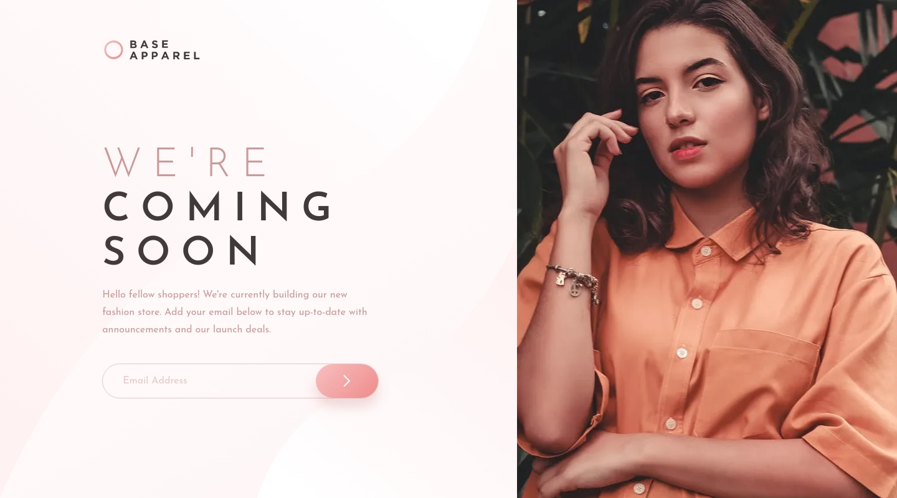
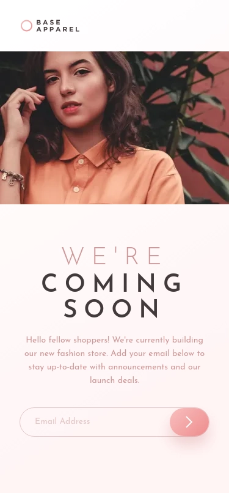

# Frontend Mentor | Base Apparel coming soon page
This is my solution to the [Base Apparel coming soon page challenge](https://www.frontendmentor.io/challenges/base-apparel-coming-soon-page-5d46b47f8db8a7063f9331a0) from [Frontend Mentor](https://www.frontendmentor.io/).

## Tech Stack
 - Angular
 - SCSS

## Developer Tools
 - VS Code
 - Figma

## Links
 - [Website](https://fem-base-apparel-coming-soon-page-jgerard.vercel.app) hosted with [Vercel](https://vercel.com/)
 - Images served from [ImageKit](https://imagekit.io/) CDN
 - [Solution](https://www.frontendmentor.io/solutions/base-apparel-coming-soon-page-bnhwuN8BRP)

## Screenshots
### Desktop

### Mobile

## About Frontend Mentor
[Frontend Mentor](https://www.frontendmentor.io/) challenges help you improve your coding skills by building realistic projects.

## Copyright
© 2023 Johnny Gérard
